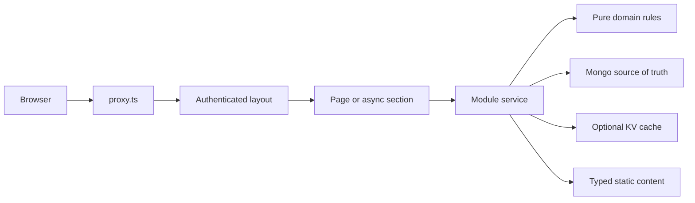
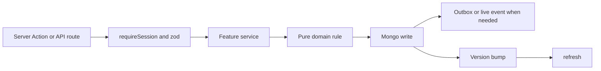
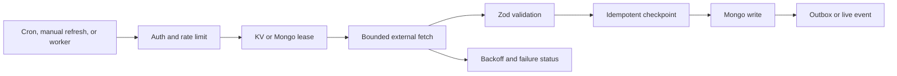

# Architecture hardening runbook

This document describes the runtime flow used by PrepOS and the performance
boundaries for future changes. Product rules remain in
[`ARCHITECTURE.md`](./ARCHITECTURE.md); this document explains how the pieces
should be assembled.

## Runtime flows

### Authenticated read

`proxy.ts` is only an optimistic redirect. The layout, every Server Action,
and every data-bearing route still performs the real session check close to
the data with `requireSession()`.

Pages should render the stable shell and fast required data first. Independent
sections belong in async `*-section.tsx` components inside `Suspense` and must
have a useful skeleton or an isolated failure state.

### Write

Day-critical writes remain synchronous. A write must have one authoritative
writer, preserve owner scoping, invalidate safe derived reads, and return
read-your-writes behavior to the browser.

### External sync

External sources are untrusted and may be slow, malformed, unavailable, or
partially successful. One source must not prevent other sources from
completing. A retry must not duplicate progress, notifications, postings, or
content.

## Data ownership and cache policy

MongoDB is the source of truth for owner data and transactional state.

- **Never cache as authority:** `DayLog`, daily plans, quiz answers, progress
  writes, settings writes, resume/profile text, and paid-LLM counters.
- **Short derived cache:** job discovery, dashboard-like aggregations, and
  external metadata. These require bounded TTLs and explicit version bumps
  after writes.
- **Longer content cache:** immutable catalogue data, validated external
  content, and LeetCode statements. These may use process memory for the
  current instance and the optional `KvStore` for cross-instance reuse.
- **Fallback:** every KV operation must have a correct Mongo fallback. Redis
  improves latency and coordination but is never required for correctness.

Cache keys must include the owner where the result depends on owner data,
must use stable parameter serialization, and must not contain secrets or
personal text.

## Performance budgets

These are targets, not correctness assumptions:

| Boundary | Target | Rule |
|---|---:|---|
| Authenticated shell | 300 ms server time | No external network calls |
| Dashboard required state | 800 ms p95 | One today bootstrap/read model and bounded Mongo reads |
| First useful dashboard paint | 1.2 s p95 | Enrichment sections stream independently |
| Static learning catalogue | 200 ms p95 | Process-memory or KV cache after cold load |
| Manual external refresh | 10 s per source | Timeout and partial-success result required |
| Cron/worker invocation | 60 s maximum | Each step reports its own outcome |
| Live event connection | 50 s | Heartbeat and reconnect; no personal payloads |

Every optimization must be checked against `recordRequestDuration`,
`recordLatency`, and cache lookup metrics. A faster response is not an
improvement if it serves stale transactional state or hides a failed sync.

## Change checklist

1. Put decisions in a pure domain function where possible.
2. Keep I/O in a module service and use narrow projections.
3. Add or update a migration for new indexes.
4. Decide whether the result is authoritative, derived, or immutable content.
5. Choose a TTL and invalidation scope before adding a cache.
6. Add a failure test for Mongo/KV/network/LLM failure where relevant.
7. Add a loading, empty, and recovery state for user-visible work.
8. Run `npm run typecheck`, `npx eslint .`, `npm test`, `npm run build`, and
   `npm run e2e`.
