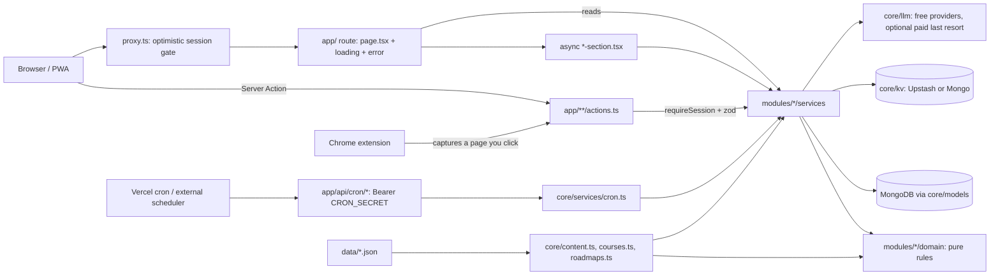

# PrepOS code structure

How the repo is built, how files call each other, and the rules that keep it that way. Read this before adding a page, a module or a component. [`ARCHITECTURE.md`](./ARCHITECTURE.md) holds the product rules, the data model and the route list; this file is about **code shape** (HLD and LLD). Rules that can be checked by a machine are enforced by ESLint (`eslint.config.mjs`) and `tests/architecture/boundaries.test.ts`, so this guide cannot drift quietly.

Want to know where something lives or who calls it? Ask the code graph instead of grepping: see [`GRAPH.md`](./GRAPH.md).

---

## 1. High-level design



Three ideas carry the whole design:

1. **Single user, no sign-up.** One owner, one session cookie (jose, `core/auth`). `proxy.ts` is only an optimistic redirect; every Server Action and API route calls `requireSession()` next to the data.
2. **Rules are pure, I/O is thin.** Business rules live in `domain/` as pure functions with Vitest tests. Services do the database, network and clock work and call the rules.
3. **Derived beats stored.** Day completion, the backlog, "caught up" days, roadmap node ticks and streak views are computed from raw progress on read. The few stored facts (a `DayLog`, a `SubtopicProgress`) have one writer each.

---

## 2. Layers and the direction of imports

```
app/                      routes, layouts, Server Actions         (top)
  modules/*/components    feature UI
  components/             shared UI: ui, shared, layout
  modules/*/services      I/O: Mongo, network, LLM, clock
  modules/*/domain        pure rules and types
  core/                   base: db, auth, env, http, kv, llm, models, content loaders, dates
data/                     static content (JSON), never imported by domain directly       (bottom)
```

An import may only go **downwards** (a higher layer uses a lower one). The rules, and who checks them:

| Rule | Enforced by |
|---|---|
| `domain/` imports no React, Next, Mongoose, models, services or UI | ESLint `no-restricted-imports` + architecture test |
| A component (anything in `components/` or `modules/*/components/`) does not import services, models or `core/db` as values (type imports are fine) | ESLint, **except** files named `*-section.tsx` |
| `app/**/page.tsx` and `layout.tsx` never import `core/models` or `core/db`; they call services | ESLint |
| `core/` reaches into a module only through its `domain/` or `lib/` (`core/services/` is the composition layer and may call any service) | architecture test |
| A module reaches into `app/` only to call a route's Server Actions | architecture test |
| Module-to-module imports are a reviewed list; a new edge needs a deliberate decision | architecture test (`BASELINE`) |
| Shared UI lives only in `components/{ui,shared,layout}` | architecture test |
| Every module has `domain/` and only `domain`, `services`, `components`, `lib` at its top | architecture test |

### Module tiers

Modules are not equal. Keep imports pointing at the more stable one.

| Tier | Modules | Rule of thumb |
|---|---|---|
| **Leaf** (own one feature) | `ai`, `aptitude`, `course`, `design`, `dsa`, `jobs`, `learn`, `mock`, `news`, `quiz`, `resume`, `roadmap`, `settings`, `targets` | Depend on `settings` and small, stable helpers such as `planner/services/plan#todayIn`. Never on another leaf's components if a prop or `components/shared` will do. |
| **Orchestration** (stitch features together) | `planner`, `progress`, `notifications`, `practice` | May read many leaves. `planner`, `progress` and `notifications` already form a knot (`progress` <-> `planner` <-> `notifications`); the architecture test freezes it so it cannot grow. `practice` (the Practice hub) is a read-only aggregator: it points at leaves and nothing may import it. |

When you need something from an orchestration module in a leaf, prefer moving the small shared piece **down** (a pure function in the leaf's or `core`'s `domain/`) over adding an upward import.

---

## 3. Folder map

```
app/
  (app)/<route>/            one folder per page: page.tsx, loading.tsx, [param]/page.tsx, actions.ts
  (auth)/login/             sign-in
  api/                      cron/*, events (SSE), export, palette, resume/*  (each authenticates itself)
  layout.tsx, globals.css   root layout, theme tokens (--day-*, --success, ...)
components/
  ui/                       shadcn primitives (button, card, tabs, dialog...)
  shared/                   app-wide building blocks (PageHeader, StatTile, Chip, ToneBadge, EmptyState...)
  layout/                   shell: sidebar, tabs, session bar, nav-items.ts (the single nav source)
core/
  auth/                     session (jose), dal (requireSession), cron guard, credentials
  db.ts, env.ts             Mongo connection, validated environment
  models/                   Mongoose schemas, one file per area (day, progress, learning, jobs, course, roadmap...)
  domain/                   cross-cutting pure code: dates, sampling, session policy
  content.ts                typed loaders for data/*.json (syllabus, problems, cases...)
  courses.ts, roadmaps.ts   loaders for courses and roadmaps (register new chapter/roadmap files here)
  llm/, kv/, notify/        providers behind ports with fallbacks (no key still works)
  realtime/, pwa/, sandbox/ SSE events, PWA splash, in-browser code and SQL runners
  http-safe.ts              the ONLY way to fetch a user-supplied URL (SSRF checks, size and time caps)
  services/                 composition layer: cron.ts, nav.ts, export.ts, seed.ts, health.ts, rate-limit.ts
modules/<feature>/
  domain/                   pure rules + zod schemas + types (Vitest tested)
  services/                 I/O; the only layer that touches models
  components/               UI for this feature (presentational, plus *-section.tsx server boundaries)
  lib/                      framework-light helpers that are not rules (parsers, bank loaders, PDF/DOCX writers)
data/                       content: syllabus.json, dsa-problems.json, quiz-bank.json, courses/, roadmaps/, notes/ ...
scripts/                    seed, quiz-bank generation, content checks, icon generation
tests/
  domain/                   pure rules
  services/                 services against an in-memory MongoDB
  content/                  every data/*.json file: schema, ids, links, references
  architecture/             the layering rules above
  components/, news/, resume/, extension/, sandbox/   feature-specific suites
extension/                  plain-JS Chrome extension (reads only the page you click it on)
docs/                       this file, ARCHITECTURE, DESIGN, BUILD_PLAN, ROADMAP, GRAPH
```

Modules today: `ai, aptitude, course, design, dsa, jobs, learn, mock, news, notifications, planner, practice, progress, quiz, resume, roadmap, settings, targets`.

---

## 4. Component taxonomy

From most reusable to most specific. Put a component in the **lowest** row that fits.

| Kind | Where | Rules |
|---|---|---|
| **UI primitive** | `components/ui/*` | No app knowledge. Variants through `cva`. Tokens only, no hex. |
| **Shared building block** | `components/shared/*` | Knows the design system, not a feature (`PageHeader`, `StatTile`, `ToneBadge`, `Chip`, `EmptyState`, `BackLink`). |
| **Feature presentational** | `modules/<f>/components/*.tsx` | Props in, markup out. No data fetching, no models, no services. Server Component by default. |
| **Server section** | `modules/<f>/components/*-section.tsx` | `async` Server Component that loads data through a service and renders a presentational component. **The only components allowed to call services.** Wrap each in `<Suspense>` on the page so slow data never blocks the page. A failure should hide the section, not break the page. |
| **Client island** | any component with `"use client"` | Only for interactivity (state, effects, browser APIs). Receives plain, serialisable props. Calls Server Actions; never imports a service. Keep it small and push logic into `domain/`. |
| **Page** | `app/(app)/<route>/page.tsx` | Reads params, calls services or mounts sections, composes `PageHeader` + components. No Mongoose. |

Naming: files are `kebab-case.tsx`, components `PascalCase`, named exports only. A route's Server Actions sit beside it in `actions.ts` (`discover-actions.ts` and `practice-actions.ts` when a route has several families).

Styling: Tailwind with the tokens in `app/globals.css` (`--success`, `--warning`, `--destructive`, `--day-done|left|missed|rest|caught`). Never hard-code colours in a component. Lists and cards are mobile-first; tap targets are at least 44px under `pointer-coarse`.

### How a file calls another (the call chain)

```
page.tsx ──► <FooSection/> (async) ──► services/foo.ts ──► domain/foo.ts (rules)
   │                                          └──────────► core/models/foo.ts (Mongoose)
   └─► <FooCard props/> (presentational) ──► <FooControls/> ("use client") ──► actions.ts ──► services/foo.ts
```

A client island never calls a service; it calls a Server Action, which does `requireSession()`, validates with zod, calls the service, then `refresh()`.

---

## 5. Request flows

**Read (a page).** `proxy.ts` redirects signed-out visitors -> `page.tsx` awaits `params`/`searchParams` -> calls a service (or mounts `*-section.tsx` inside `<Suspense>`) -> service reads Mongo and applies `domain/` rules -> page renders presentational components. `loading.tsx` gives the streaming skeleton; `error.tsx` catches failures.

**Write (a Server Action).**
```ts
"use server";
export async function doThingAction(input: unknown): Promise<ActionResult> {
  await requireSession();                         // always first
  const parsed = schema.safeParse(input);         // zod, never trust input
  if (!parsed.success) return { ok: false, error: "..." };
  try { await doThing(parsed.data, todayIn(await getSettings())); refresh(); return { ok: true }; }
  catch (err) { return { ok: false, error: err instanceof Error ? err.message : "Couldn't save" }; }
}
```
Dates are `YYYY-MM-DD` in `APP_TIMEZONE` through `core/domain/dates.ts`; never `new Date().toDateString()`.

**Cron.** `app/api/cron/*` checks `Bearer CRON_SECRET`, calls `core/services/cron.ts`, which calls module services. The app must also work **without cron**: `ensureToday()` runs on dashboard load.

**LLM.** Only through `core/llm` (free providers first; the optional paid provider is a last resort behind confirmation and a daily cap). Treat output as untrusted text: validate with zod, never `dangerouslySetInnerHTML`, cache only validated output. With no key the app falls back to `data/quiz-bank.json`.

---

## 6. Data: stored vs derived

| Fact | Stored? | Single writer |
|---|---|---|
| Day completion (`DayLog.complete`) | stored | `recomputeDay` (`modules/planner/services/day.ts`) |
| Subtopic done, problem solved | stored | `toggleSubtopic`, `recordSolve` (`modules/progress/services/progress.ts`) |
| Course lesson done, roadmap link read | stored (own collections) | `modules/course`, `modules/roadmap` services |
| Backlog (what is owed) | **derived** | `loadBacklogItems` |
| "Caught up" days | **derived** | `loadCatchUp` |
| Roadmap node done | **derived** | `nodeStatus` |
| Streak views, week ring, milestones | **derived** | `modules/progress/domain/streak*.ts` |
| Settings | stored singleton | `modules/settings/services/settings.ts` |

**Content pipeline.** `data/*.json` (never edited by hand unless asked) -> typed loader in `core/` -> validated by a `tests/content/*.test.ts` (schema, unique ids, existing problem/lesson/quiz references, https links, no raw HTML). Syllabus subtopic ids are `${topicId}:${index}` and are append-only.

**Separate tracks never touch the plan.** Web-dev, courses and roadmaps keep their own JSON and progress collections and never write `DayLog`, the streak or `syllabus.json`. A syllabus subtopic counts for the plan only when it is ticked.

---

## 7. Next.js 16 conventions used here

- `proxy.ts` (not `middleware.ts`); `cookies()`, `headers()`, `params` and `searchParams` are **async**; page and layout props are typed with the generated `PageProps<"/route">` / `LayoutProps` (`npm run typecheck` runs `next typegen` first).
- Streaming: `loading.tsx` per route and `<Suspense>` around each async section; `after()` for work that must not delay the response (background news refresh).
- `Link` hrefs are plain strings, with `refresh()` after mutations from Server Actions.
- Lint is `npx eslint .` (there is no `next lint`). Dev and build use Turbopack.

**Decisions on the newer switches (recorded so nobody re-runs the experiment):**

| Feature | Decision | Why |
|---|---|---|
| `typedRoutes` | **Not enabled** | Tried: 59 type errors, because most links are built from runtime values (dates, slugs, ids). Making it pass needs casts everywhere and buys little safety here. |
| `reactCompiler` | Not enabled | Needs `babel-plugin-react-compiler` and slower builds; no measured render problem to fix. Revisit if a client island gets slow. |
| `cacheComponents` / `'use cache'` | Not enabled | Almost every page is per-request and authenticated. The only static candidates are catalogue pages (courses, roadmaps content); revisit with a measured need. |

---

## 8. Testing map

| Where | What | How |
|---|---|---|
| `tests/domain` | Pure rules: planner, streak, catch-up, carry limits, jobs insights | Plain Vitest, no I/O |
| `tests/services` | Services with real Mongoose | In-memory MongoDB (`tests/services/db.ts`: `startDb`, `resetDb`, `at(date)` for fixed clocks) |
| `tests/content` | Every `data/*.json` | Schema + references |
| `tests/architecture` | The layering above | Reads the source tree |
| `tests/components`, `news`, `resume`, `extension`, `sandbox` | Feature suites | Vitest |

Definition of done for any change: `npm run typecheck`, `npx eslint .`, `npm test`, `npm run build` all pass.

---

## 9. Recipes

**Add a page.** Create `app/(app)/<route>/page.tsx` (+ `loading.tsx`). Call a service or mount a `*-section.tsx`. Add a nav entry in `components/layout/nav-items.ts`. Add `generateMetadata` if the title depends on params.

**Add a Server Action.** In the route's `actions.ts`: `"use server"`, `requireSession()`, zod, call a service, `refresh()`, return `ActionResult`.

**Add a feature module.** `modules/<name>/{domain,services,components}` (+ `lib/` if needed). Rules go in `domain/` first with a test. Models go in `core/models/<area>.ts`. If it imports another module, add the edge to `BASELINE` in `tests/architecture/boundaries.test.ts` and say why. Register any backup collection in `core/services/export.ts`. Update this file's module list.

**Add a component.** Pick the lowest row of the taxonomy that fits. Presentational? Props only. Needs data? Make it an async `*-section.tsx`. Needs state? Make a small `"use client"` island and call a Server Action.

**Add a course chapter / roadmap / question bank.** Course: drop `data/courses/<course>/NN-chapter.json`, register it in `core/courses.ts`; `tests/content/courses.test.ts` validates it (and that every `practiceRef` and problem slug exists). Roadmap: `data/roadmaps/<id>.json`, register in `core/roadmaps.ts`. Quiz questions: see `scripts/quiz-bank` and `npm run quiz-bank`.

**Add a setting.** Field on the model in `core/models/system.ts`, a typed value in `AppSettings` (`modules/settings/services/settings.ts`), a setter + zod-validated action, and UI. Document an env var in the README and `.env.example` if one is needed.

**Add a cron job.** A route under `app/api/cron/` that checks `Bearer CRON_SECRET`, a function in `core/services/cron.ts`, and an entry in `vercel.json` (or the external scheduler note in the README).

---

## 10. Hard rules (summary; full list in `AGENTS.md`)

Single user, no sign-up. Free tier only (one owner-approved paid LLM last resort, one optional Redis). The **daily quiz is mandatory for completing a streak day**. Every Server Action checks the session. All input validated with zod; LLM output is untrusted. Resume text is private and never logged. Day logic only through `core/domain/dates.ts`. Never reorder or delete syllabus subtopics. The app works with no LLM key and without cron.
